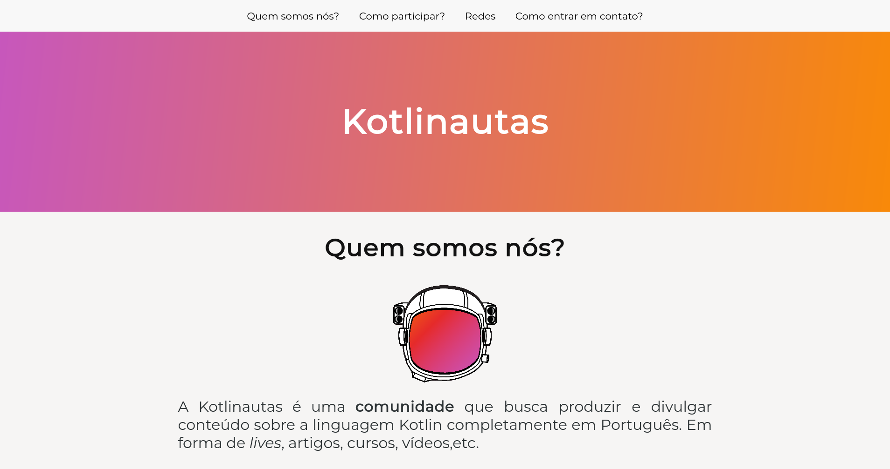

# Site oficial da Kotlinautas

Esse é o repositório que contém os arquivos do site oficial da Kotlinautas

# Contribuição

Para contribuir nesse repositório, vá até as [issues do projeto](https://github.com/kotlinautas/site-oficial/issues), procure por uma issue que você consiga fazer, e crie uma *Pull Request* resolvendo essa issue.
